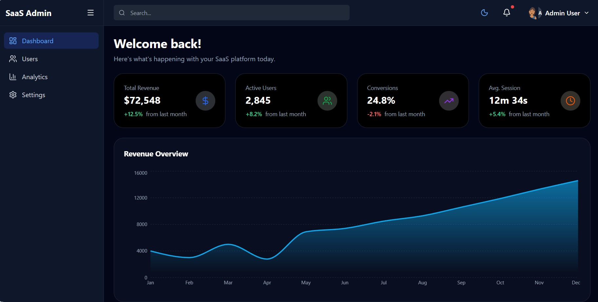
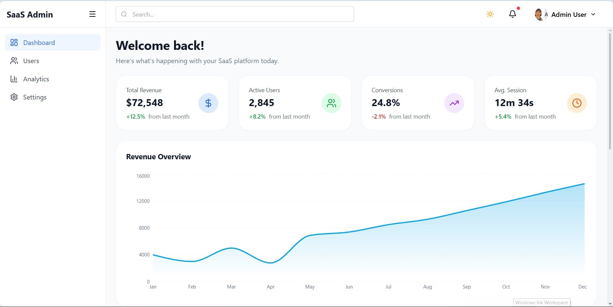

# 🚀 Premium SaaS Dashboard - Next.js 14

A modern, fully responsive SaaS Dashboard built with Next.js 14, Tailwind CSS, and Shadcn UI. This project features full theme synchronization (Light/Dark/System) and interactive analytics.

## ✨ Key Features

* 🌓 Dynamic Theming: Seamless switching between Light and Dark modes with automatic icon swapping (Sun/Moon).
* 📊 Interactive Analytics: Revenue Overview and User Activity charts powered by Recharts, fully adaptive to the selected theme.
* 👥 User Management: Comprehensive Users page with status badges, filtering, and modern table layouts.
* ⚙️ Advanced Settings: Profile management, security toggles, and UI preference settings.
* 📱 Fully Responsive: Mobile-first design that looks stunning on phones, tablets, and desktops.
* ⚡ Optimized Performance: Built with the Next.js App Router for instant page transitions and server-side optimization.

## 🛠 Tech Stack

* Framework: [Next.js 14](https://nextjs.org/) (App Router)
* Styling: [Tailwind CSS](https://tailwindcss.com/)
* Components: [Shadcn UI](https://ui.shadcn.com/) / [Radix UI](https://www.radix-ui.com/)
* Icons: [Lucide React](https://lucide.dev/)
* Charts: [Recharts](https://recharts.org/)
* Theming: [Next-Themes](https://github.com/pacocoursey/next-themes)

## 🚀 Getting Started

1. Clone the repository:
   ```bash
   git clone [https://github.com/Kuwuwuwu/nexus-admin-dashboard.git](https://github.com/Kuwuwuwu/nexus-admin-dashboard.git)

## 📸 Screenshots

### Dark Mode


### Light Mode
